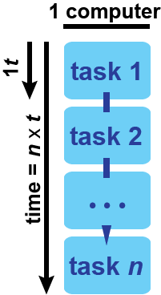
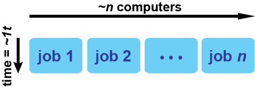

# An Introduction to High Throughput Computing using HTCondor

## Getting Started

* Log in to the submit node

~~~
$ ssh <netid>@submit-x.chtc.wisc.edu
~~~

* Get the materials for this tutorial

~~~
$ git clone https://github.com/CHTC/htc-intro
$ cd htc-intro/
~~~

* Look at the files

~~~
$ ls
$ less basic.submit
~~~

Type `q` to exit the `less` program.  

## Scripts and Science

This directory should contain a script called `print_msg.sh`.  It takes in any 
text as an argument and prints a greeting to file.  

> ### Try it
>
> Try running `print_msg` with a name of your choice.  What is the output?  

Most computational tasks in science can be reduced to this simple paradigm of 
input/arguments -> program -> output.  We will later refer to this chain as a "job".  

> ### Discussion
>
> What does your computational task look like?  What are the input and output?  

In order to run your computational task on a shared computing resource like CHTC, 
you must be able to run it from the command line with a single command (or write 
a single script that executes your task as a series of commands).  

(include contrasting images)

## For Loops

What if I wanted to run this script multiple times, to print many messages?  

The typical way to do this is the programming construct called a for loop.  

~~~
for num in {0..4}
do
	./print_msg $num
done
~~~

Running a for loop on your computer means that you are only using one or two processors.  

> ### Discussion
>
> What factors would make running this kind of loop on one computer impractical?

## High Throughput Computing

High throughput computing is a way of changing the for loop so that each task, or 
*job*, can each be run separately on its own processor, instead of all in a row 
on one processor.  Graphically, that looks like this: 

In this model, it is not practical for you to run the job directly on all 
the computers.  There needs to be a program that assigns the jobs to computers and then
runs them for you.  This kind 
of program is called either a *batch system* or *batch scheduler*.  For our *pool* of 
computers, the scheduler is *HTCondor*.  

If we were using regular code to tell the scheduler how many jobs we want to run, 
we might use a for loop: 
~~~
for num in {0..4}
	queue a job that runs
	print_msg $num
~~~

This kind of loop is implemented in a specific kind of file, called a *submit file*, 
which is given to the scheduler.  The submit file contains instructions for the loop,
and the scheduler reads it and then will create the jobs described in the loop, and 
then run them.  

## Submit File Basics

### Numerical arguments: 

Suppose I want to loop through the numbers 0-4 and print a message with each number, 
like this: 

~~~
for num in 0..4
	print_msg num
~~~

To treat each step of the loop as a separate job, assigned to a different machine, 
I would use the following lines in a submit file:

~~~
executable = print_msg.sh
arguments = $(Process)

queue 5
~~~

The `queue` keyword will generate a certain number of jobs (5, in this case) and 
the `$(Process)` is a special variable that iterates from zero to N-1 (here, from 0 
to 4), creating a job for each process number.  

> ### Try it
>
> Fill out the executable and argument lines in `basic.submit`.  Then change the 
> `queue` statement to run 5 jobs.  

### What if your arguments aren't numbers?  

Suppose instead of printing numbered messages, I want to print a message to every 
person listed in the `names.txt` file.  So I want the behavior of:

~~~
for name in names.txt
	print_msg name
~~~

In a submit file, the syntax for this looks something like this: 
~~~
executable = print_msg.sh
arguments = $(name)

queue name from names.txt
~~~

> ### Try it
>
> Make a copy of `basic.submit` called `names.submit`.
> Change the appropriate lines in `names.submit` to reflect the code above.  You 
> may also want to the change the prefix to the log/output/error files.  

## Submitting and Managing HTCondor Jobs

Now that we have moved our multiple tasks into a submit file, we can submit them 
to Condor and let it run them for us.  

### Condor commands

* Submit a job: `condor_submit <submit_file>`
* Look at jobs in the queue: `condor_q <netid>`
	* The left-hand column indicates the `JobId` (cluster and process number).  The 
	state has 3 main options: `I` for idle, `R` for running and `H` for held.  
	* `condor_q` has lots of options.  You can use `condor_q -l <JobId>` to look 
	at information about a specific job, or `condor_q -hold` to see why your jobs 
	are on hold.  See the [Manual Page](http://research.cs.wisc.edu/htcondor/manual/current/condor_q.html) for more information.  
* Remove jobs from the queue: `condor_rm <netid>` or `<condorm_rm <JobId>`

## Side Note: Directory Organization I

At this point, our directory is probably getting a little crowded: 

~~~
$ ls 

0_greeting.txt      basic_466513_2.out      images               names_466565_2.out
1_greeting.txt      basic_466513_3.err      lesson.md            names_466565_3.err
2_greeting.txt      basic_466513_3.log      LICENSE.md           names_466565_3.log
3_greeting.txt      basic_466513_3.out      Mickey_greeting.txt  names_466565_3.out
4_greeting.txt      basic_466513_4.err      Miss_greeting.txt    names_466565_4.err
basic_466513_0.err  basic_466513_4.log      names_466565_0.err   names_466565_4.log
basic_466513_0.log  basic_466513_4.out      names_466565_0.log   names_466565_4.out
basic_466513_0.out  basic.submit            names_466565_0.out   names.submit
basic_466513_1.err  Bucky_greeting.txt      names_466565_1.err   names.txt
basic_466513_1.log  Bugs_greeting.txt       names_466565_1.log   print_msg.sh
basic_466513_1.out  Christina_greeting.txt  names_466565_1.out   README.md
basic_466513_2.err  Donald_greeting.txt     names_466565_2.err   translate
basic_466513_2.log  figs                    names_466565_2.log
~~~

Even when just getting started, it is important to organize your files in a sensible 
way.    

> ### Try it
> 
> Let's put our "message" jobs into a directory called `messages`  Then, in 
the `messages` directory, split our two 
> job batches into two directories, `basic` and `names`

~~~
htc-intro/
    messages/
    	print_msg.sh
        basic/
        	basic.submit
            (log/error files)
            *_greeting.txt
        names/
        	names.submit
        	(log/error files)
        	*_greeting.txt
        	names.txt    	
~~~

> ### Tips
> 
> * The `mkdir` command will make directories.  
> * The wildcard `*` will be very useful in moving groups of files.  
> * Tab completion is your friend!  

> ### Follow up 
> 
> If we try to re-submit the `basic.submit` file, what goes wrong?  How could it be fixed?  

Note that the any output files created by a batch of jobs 
will always come back to the directory from which you submitted the submit file.  There 
are other ways to redirect your input to other files, which we will discuss after 
the next example!  

## Input Files

What if the difference between jobs is not an argument passed to the script, but an 
input file?  In the `images` directory, there is an `img_convert.sh` script that will take 
in a jpg 
image and convert it to an ascii text file.  We also have two 
sub-directories of images that we would like to convert using this script.  We want 
a loop that does this: 

~~~
for img in img_dir/
    queue job, where job runs
    img_convert.sh img
~~~

Like before, there is a specific syntax to do this in the submit file.  

### Numerically-named input files

Just as we used `$(Process)` to create jobs with different numerical arguments, we 
can also use it to indicate different numbered input files.  The submit file 
notation will look something like this: 

~~~
executable = ../img_convert.sh
transfer_input_files = image$(Process).jpg

queue 3
~~~

If our script also needs the name of the file as an argument, then we should add 
`$(Process)` to the arguments line as well: 

~~~
arguments = image$(Process).jpg
~~~

> ### Try it
>
> Copy `image.submit` to the `wi_imgs/` directory.  Then
> add the above lines to `image.submit` and try submitting the jobs.  

### List of files with common prefix or extension

We also have a list of images that aren't numbered, in the `art_imgs` directory.  Instead 
of using `$(Process)` for that group of images, we will use the following submit file
syntax: 

~~~
executable = ../img_convert.sh
arguments = $(img)
transfer_input_files = $(img)

queue img matching *.jpg
~~~

> ### Try it
>
> Make a copy of `image.submit` called `art.submit` in the `art_imgs/` directory.  Change 
> the appropriate lines to create a job batch that analyzes all the images in the 
> directory.  Submit the jobs.  

## Side Note: Directory Organization II

So far, each of our programs has just created one output file, so it's not too bad 
to keep all the input/output files in the same directory.  But what if we have a lot 
of output files?  Or a lot of input files?  In the `translate` directory, there is a 
script that will take one input file (in English) and produce three output files (in 
German, French and Spanish).  There's a submit file option that will allow the 
translation of each English word to have its own directory.  

~~~
executable = translate.sh
# arguments = 

initialdir = $(Process)
transfer_input_files = word.txt,../dictionary/

queue 5
~~~

> ### Try It
> 
> Edit the `translate.submit` file to include the above lines.  Then try submitting 
> the batch of jobs.  Where are the log/error/output files?  Why did we use `word.txt` 
instead of `$(Process)/word.txt` in the `transfer_input_files` line?  

## Mixing and Matching

The sky's the limit!  Using these basic ideas of queuing multiple jobs (either 
with `queue #`, `queue item matching *.txt` or `queue item from file.txt`), and 
organizing your job submission folders with paths and `initialdir = `, you can 
submit batches of jobs in many ways 

> ### Discussion
> 
> What are the pieces of your computing task?  How do you want to organize them?  How 
> can you implement that structure in a submit file?  

## Resources

* http://chtc.cs.wisc.edu/helloworld.shtml
* http://chtc.cs.wisc.edu/submit_variations.shtml
* http://research.cs.wisc.edu/htcondor/manual/quickstart.html
* http://research.cs.wisc.edu/htcondor/quick-start.html