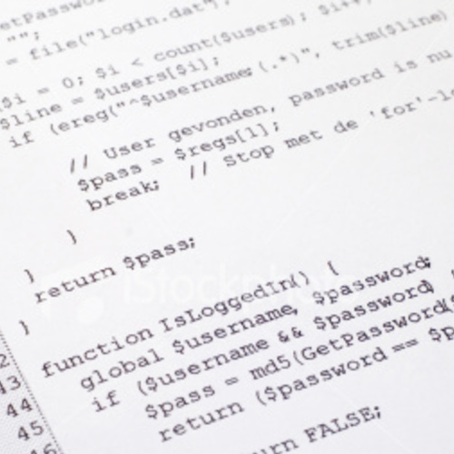
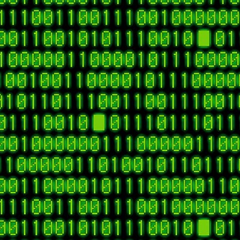
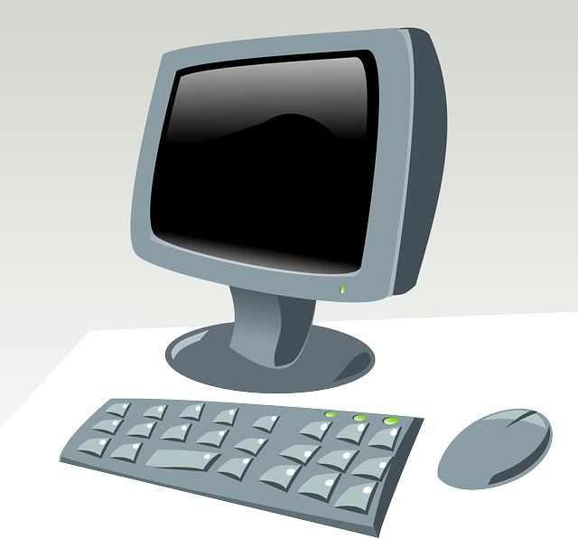

# "Backpacking with Code"
## Running software on the Open Science Grid (or anywhere!)

<!-- cut this?  
## What is Software?

* Software (aka programs, code, scripts) are all different forms of 
providing *instructions* to a computer.
* Running a piece of software *depends* on many factors: compilation, 
libraries/packages, base operating system, etc.
* To run software in OSG (or any distributed system), one must consider 
these factors and make the software *portable*. 
-->

<!-- Note: today, discuss what it means for software to be portable, 
different types of software and how that impacts their portability -->

## Motivation

### Running a piece of software is like cooking a meal.  

#### Running on your own computer -> cooking in your own kitchen

* you have all the pots/pans you need
* you know where everything is
* you have access to all the cupboards
* if you're missing something, you can buy it 
and it will still be there next time

## Motivation

### Running a piece of software is like cooking a meal.  

#### Running on the open science grid --> cooking in someone else's kitchen

* everything you need might not be there
* you don't know where everything is
* not everything is accessible to you

## Motivation

#### Software portability --> thinking like a backpacker

* take EVERYTHING you need
* make sure that you can work in a limited amount of space
* clean up after yourself!  

## Software 

How do we make software portable?  First, we have to understand 
what software is, how it works, and different ways to install it 
and make it run.  

## Compiling 

All software starts as text (code) written by people, which is then translated 
into something the computer understands and can run.  

 --> 
 -->
 -->

This translation process is called compiling.  

## Installing

Installation refers to the: 
* where: the location on the computer where the software will be accessed
* how: it is compiled or otherwise placed in that location
* dependencies: the other libraries or programs the software may depend on (including features
of the base operating system)

## Portability

All of the pieces of the installation process will determine how 
portable your software is: 
* where: does the software need to be installed to a system location that is only 
accessible to someone with administrative privileges?  Or can 
it be installed to a local directory?  
* how: does the software require a specific compiler?  How is it compiled?  
* dependencies: does the software require other packages/software to be installed?  If so, 
where do those packages need to be?  Will the software run on multiple operating 
systems?  

* Also, licensing.  

## Some examples: 

* Need these.  :P

<!-- comment: next address these various concerns and how you might make different 
forms of installation portable -->  

## Compiling: pre-compiled

 --> 
 -->
 -->

## Compiling: dynamically

 --> 
 -->
BABELFISH -->

<!-- Note: the first half of the morning will focus on pre-compiled programs, 
we'll talk about dynamic programs (python, R) in the second half of the morn -->

## Static compiling

 --> 
 -->
 -->

## Linked compiling/installation

 --> 
 -->
 -->

# Exercises

<!-- Need to find/provide: sample executable (and input) that is pre-compiled; 
 simple fortran program, program to compile (cowsay?) 
 -->

## Pre Exercise

* Create a directory called "software portability"
* Create 3 directories within that, one for each exercise, each with a copy of
(`template` submit file?)

## Exercise 1

* Download (program x) from (web address)
* Submit a job running (x)

## Exercise 2

* copy our fortran code into the 2nd directory
* statically compile
* submit a job

## Exercise 3

* cowsay?  